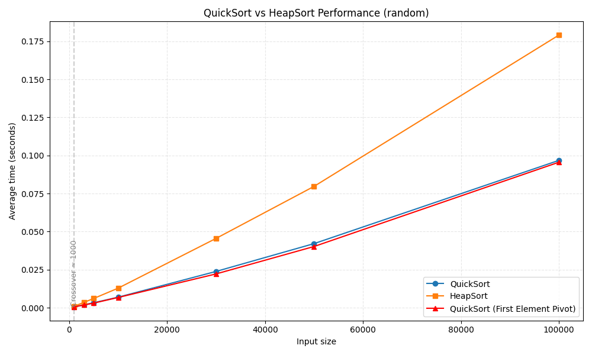

# 1dv018 Assignment 3

Samuel von Zweigbergk - sv222rr

## Requirements

- Python 3.13+

## Using UV

- Install uv: see `https://docs.astral.sh/uv/getting-started/installation/`
- Sync dependencies and create venv: `uv sync`
- Run the program `uv run main.py`

## Using PIP

- Install dependencies: pip install matplotlib
- Run the program `python main.py`

## Optional (dev tools)

- Lint/format: `pip install ruff`
- `ruff check`
- `ruff format`

## Notes Task 1

I implemented:
- **QuickSort** with median-of-three pivot selection
- **HeapSort** as a fallback algorithm
- **DynamicSort**: a hybrid that switches between them based on recursion depth
- The switching depth is calculated as: `max_depth = 2 × log₂(n)` where `n` is the list length

### The Experiment

#### Test Cases

I ran my algorithm against various data patterns to see when QuickSort would fail and need to switch to HeapSort:

1. **Random data**: the happy case
2. **Sorted data**: potential worst case for QuickSort
3. **Reverse sorted data**: another tricky scenario
4. **Duplicates**: when pivot selection matters less

#### Results

##### Random Data

With random data, both QuickSort versions perform nearly identically and beat HeapSort. Random data is a sweet spot where even naive pivot selection works well. QuickSort's advantage over HeapSort grows as the dataset gets larger.

##### Sorted Data

On sorted data, QuickSort with median-of-three stays fast and efficient. First-element pivot starts to show degradation, growing noticeably faster than the median-of-three version. This is where pivot choice begins to matter.

##### Reverse Sorted Data

The results are nearly identical to the sorted data case. First-element pivot performs much worse than median-of-three. The reason is the same: when data is sorted or reverse sorted, the first element is always either the smallest or largest value. This means every partition puts only one element in its final position, leaving nearly all remaining elements on one side. Instead of dividing the problem in half each time, the algorithm barely reduces the problem size. This creates a recursion tree that's almost a linked list.

##### Duplicates

On duplicate data, both QuickSort versions stay pretty close together and both are faster than HeapSort. Duplicates make it easier to create balanced partitions no matter which pivot strategy is used.

## The Hypothesis

When I started this assignment, I expected to find a crossover point where HeapSort would eventually beat QuickSort. The idea was that at some problem size, QuickSort would start degrading while HeapSort kept its steady O(n log n) performance. If I could find that crossover, I could use it to derive when the DynamicSort should switch from QuickSort to HeapSort.

But that's not what happened.

## What Actually Happened

QuickSort with good pivot selection never really loses to HeapSort across any of my tests. Even on the worst realistic cases (sorted and reverse sorted data), it stays faster. The only time QuickSort gets really slow is with poor pivot selection, and even then it's not that it eventually loses to HeapSort—it just gets slower across the board.

This means the formula I ended up using (`max_depth = 2 × log₂(n)`) isn't based on finding a crossover point. Instead it's just a conservative safety net. It says "if we recursed this deep with good pivot selection, we probably have bad data, so switch to HeapSort just in case." It's not about beating HeapSort. It's about protecting against edge cases we might not have anticipated.

## The Theoretical Worst Case for Median-of-Three

Even median-of-three can have a worst case, but it's much harder to construct than for first-element pivot. The worst case would need to be something that causes bad partitions at every recursion level, not just once. For example, a nearly-sorted list with many duplicates could potentially cause repeated bad partitions because you're more likely to pick extreme values as your median-of-three.

In practice though, this is extremely rare. Median-of-three is designed specifically to avoid these edge cases by being less predictable than first-element selection. You'd need to deliberately construct pathological data to hit its worst case.

## Conclusion

The biggest lesson here isn't about finding some perfect formula. It's that pivot selection matters way more than algorithm choice when it comes to comparing these two algorithms. A poorly implemented QuickSort crashes. A well-implemented QuickSort just works. And a hybrid approach like DynamicSort is really just saying "I've thought about edge cases" rather than "this is fundamentally better."

For practical purposes, QuickSort with median-of-three is solid. The hybrid approach is extra insurance that probably isn't needed.
